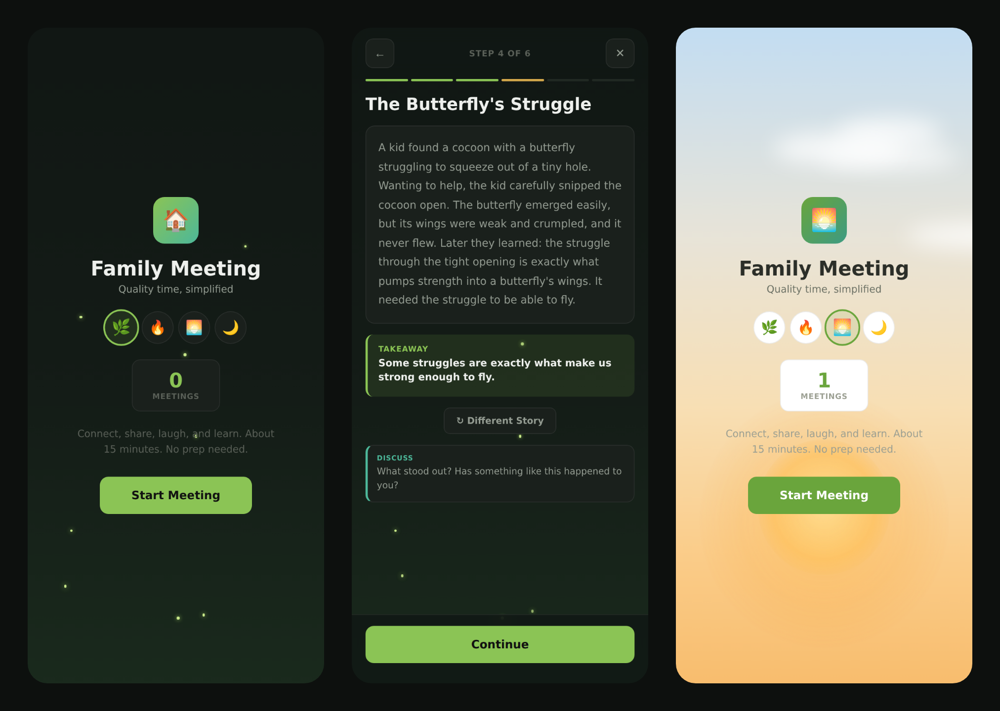

# ✨ Family Meeting Hub

> A free, guided web app that walks your family through a 15-minute meeting — connect, share, laugh, and learn. No accounts, no ads, no data collection.

---

## 🤔 What is this?

Family meetings die from one question: *"so... what do we talk about?"*

This app answers it. Press **Start Meeting** and it walks you through six steps in order, each with a prompt already picked for you. About 15 minutes, no prep, works on any phone, tablet, or laptop.

## 🚀 Live Demo

### **[https://jukes31ryan.github.io/Family-Meeting-Hub/](https://jukes31ryan.github.io/Family-Meeting-Hub/)**

---

## 📋 The Six Steps

| # | Step | What happens |
|---|------|--------------|
| 1 | **Ground Rules** | Five quick reminders — one voice at a time, phones away, okay to pass, what's shared stays here |
| 2 | **Inspiring Quote** | A quote to reflect on together, with a discussion prompt. Tap ↻ for another |
| 3 | **Check-In** | Everyone shares a **High**, a **Low**, and a **Buffalo** (something random, funny, or surprising) |
| 4 | **Story Time** | A short fable with a clear takeaway, plus a question to talk it over |
| 5 | **Dad Joke** | Setup, tap to reveal, then rate it 1–10. Ratings are saved and averaged over time |
| 6 | **Bonus Activity** | An optional game, science experiment, or creative exercise if you have time |

---

## ✨ Features

* **Guided flow with a progress bar** — always know where you are and what's next. Go back or exit any time.
* **A lot of content, zero repetition:**
  * 50 quotes
  * 30 stories, each with a takeaway
  * 50 family-friendly jokes
  * 40 activities — 15 games, 15 science experiments, 10 creative exercises (filterable by type)
  * 14 "who goes first?" tiebreakers
* **Science experiments include materials lists** — you'll know before you start whether you have what you need.
* **🎲 Pick for us** — settles who shares first without an argument ("whoever ate breakfast first goes first!").
* **Joke ratings** — rate each joke 1–10; the app remembers your family's running average.
* **Meeting counter** — tracks how many meetings you've completed.
* **4 themes** with animated backgrounds: 🌿 Meadow (fireflies), 🔥 Campfire (rising embers), 🌅 Morning (sun and drifting clouds), 🌙 Evening (stars). Your pick is remembered.
* **Fully offline** — no API calls, no network needed after first load.

---

## 💻 Tech Stack

A single self-contained `index.html`. That's the whole app.

* **HTML5**
* **CSS3** (CSS variables for theming)
* **Vanilla JavaScript** — no frameworks, no build step, no dependencies

All content is embedded in the file, so nothing breaks when a third-party API goes down. Your theme, meeting count, and joke ratings are stored in your browser's `localStorage` and never leave your device.

### Running it locally

Clone the repo and open `index.html` in a browser. There is no build step.

---

## 🌅 Also in this repo: First Light

A second, separate app lives in [`first-light/`](first-light/) — a personal *morning* launcher, not a family one. A boot sequence for the brain: a quote, a laugh, a full-length fable, a breathing timer, your own daily reminders one card at a time, then Purge / Top 3 / WIN to point you at the day. A 5x5 mini crossword wakes the brain up, and a 15-second evening close-out shuts the loop at night.

### **[Open First Light →](https://jukes31ryan.github.io/Family-Meeting-Hub/first-light/)**

* **Installable PWA** — `manifest.webmanifest` + `sw.js` + icons. Add it to your home screen and it runs full-screen and fully offline.
* **18 full-length fables**, each ending on an earned takeaway.
* **69 quotes** from warriors and poets — Sun Tzu, Musashi, Marcus Aurelius, Seneca, Epictetus, Rumi, Whitman, Oliver, Rilke, Frost, Kipling, Angelou, Emerson, Whyte.
* **18 hand-built mini crosswords**, one per day, no external API.
* **Your software is yours** — reminders and quotes are edited in Settings, never in the code.
* **Export / import** your whole history as a JSON file, so a cleared browser can't erase it.

Data lives in `localStorage` under `fl`-prefixed keys and never leaves the device.

---

## 💬 Feedback & Contributions

This is a personal project built with love. If you have feedback, feature ideas, or suggestions for prompts, please open an Issue.

While formal code contributions are not being sought, you are welcome to fork this repository and customize it for your own family.

---

## 📄 License

MIT

---

## 👤 Author

**jukes31ryan** · [@jukes31ryan](https://github.com/jukes31ryan)
